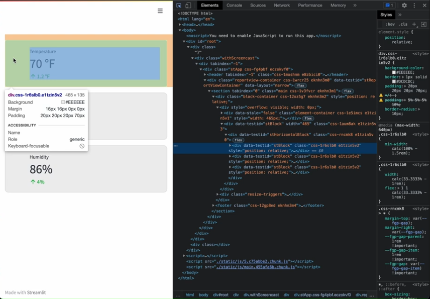

Auteur : **Pinto Katende Jonathan**
# Les bases de Streamlit

### Installation de Streamlit via cmd
```pip install streamlit```

### Tester streamlit via cmd
```streamlit hello```

### Les inputs de base
Parmi les inputs, nous avons :

- checkbox
- button
- selectbox
- slider
- radio
- time_input
- ...

## 1. Basiques
---
### Partie 1
```python
import streamlit as st

# Titre
st.title("Mon titre")

# Header
st.header("Header")

# Sub-Header
st.subheader("Sous titre")

# Information
st.info("Une information classique")

# Avertissement
st.warning("Attention")

# Erreur
st.error("Erreur")

# Toast
st.toast('Mr Stay-Puft')

# Succès
st.success("Envoyé avec succès")

# Pour Ecrire le markdown
st.write("Hello Markdown")
st.write("""
    # Titre dans le markdown
    **Bold in Markdown**
    ---
""")

# Markdown avec possiblité du Html
st.markdown("<h1>Hi Html in Markdown</h1>")

# Texte
st.text("Welcome")

# caption
st.caption("Caption test")

# Math
st.latex(r''' delta = b^2 - 4ac''')

# code
st.code('for i in range(8): foo()')
```

### Partie 2
```python
#image
st.image("img.png")
st.audio(data)
st.video(data) 
```
Idem pour les vidéos et les audios.

#### Les inputs
```python
# checkbox
st.checkbox("Accepter")

# Button
st.button("click")

# radio
st.radio("Genre", ["masculin", "feminin","neutre"])

# selectbox
st.selectbox("Genre", ["masculin", "feminin","neutre"])

# Multiselect
st.multiselect("Genre", ["masculin", "feminin","neutre"])

# slider (str, min, max, step)
st.slider("Genre", 0, 10, 2)

# select_slider
st.radio("Niveau", ["Primaire", "secondaire","supérieur"])

# nombre
st.number_input("choisi un nombre", 0, 12)

# Text
st.text_input("Entre un text")

# Textarea
st.text_area("Entre un commentaire")

# Date
st.date_input("choisi une date")

# Temps
st.time_input("Entre une date")

# Fichier
st.file_upload('Drag and drop')

# Color Picker
st.color_picker('color')

# Progress Bar
st.progress(90)

# Loader
st.spinner("Chargement...")

# Ballons
st.balloons()

# Snow
st.snow()

# Camera
st.camera_input("一二三,茄子!")
```

### Sidebar

Pour la sidebar, tous les champs sont identiques aux précédents, à la seule condition de précéder par ```st.sidebar.```

**Cas d'utilisation**

```python

# Sidebar title
st.sidebar.title("Bienvenue sur la sidebar")

st.sidebar.text_input("Sidebar text input")
st.sidebar.button("click")
# ...
```

### Event

#### Button click

```python
# Exemple 1
# ------------------------------
button1 = st.button("Envoyez")

if button1:
    st.write("Hello streamlit")

#-------------------------------

# Exemple 2
#-------------------------------
pref = st.checkbox("Aimez-vous python?")
button2 = st.button("Test")

if button2:
    st.write(pref)
#-------------------------------

# Exemple 3
#-------------------------------
if button2:
    if pref:
        st.write("J\'aime Python")
    else:
        st.write("Pas du tout")
#-------------------------------

# Exemple 4
#-------------------------------
radio = st.radio("Statut", ["M.", "Mme"], "Mme")

button = st.button("Test")

if button:
    if radio == "M.":
        st.write("Bonjour Monsieur")
    else:
        st.write("Bonjour Madame")
#-------------------------------

# Exemple 5
#-------------------------------
langages = st.multiselect("Quel langage avez-vous déjà utililisé?", ["PHP", "Python", "Ruby", "R", "Javascrit", "Html", "CSS"])

if st.button("Click"):
    langages
    st.write(langages[0])
#-------------------------------
```

### Excel
```python
import pandas as pd
import streamlit as st

data = pd.read_excel("data.xlsx")

st.dataframe(data)
st.table(data.iloc[0:10])
st.line_chart(df)
```

### Optimize performance
Pour l'optimisation, on utilise le décorateur @st.cache_data, et pour supprimer le cache, on utilise st.cache_data.clear().

```python
@st.cache_data
def add(a,b): 
    return a+b

res1 = add(1,2)
res2 = add(5,2)
res3 = add(3,20)
res4 = add(1,-2)

st.cache_data.clear()

```

### Formulaire, Tabs et Colonnes
Les formulaires ne passent que sur une version supérieur à 0.81

+ **Colonnes**

```python
col1, col2 = st.columns(2)
col1.write('Column 1')
col2.write('Column 2')

# Three columns with different widths
col1, col2, col3 = st.columns([3,1,1]) #col 1 60% width
# col1 is wider

# Using 'with' notation:
>>> with col1:
>>>     st.write('This is column 1')

# Au lieu de col1.write, avec with, on peut écrire les commandes habituelles (st.)
```

+ **Tabs**

```Python
# Insert containers separated into tabs:
>>> tab1, tab2 = st.tabs(["Tab 1", "Tab2"])
>>> tab1.write("this is tab 1")
>>> tab2.write("this is tab 2")

# You can also use "with" notation:
>>> with tab1:
>>>   st.radio('Select one:', [1, 2])
```

+ **Formulaire**

```python
# Méthode 1
with st.form(key='my_form'):
    username = st.text_input('Username')
    password = st.text_input('Password')
    age = st.date_input("Date de naissance")

    validate = st.form_submit_button('Login')

    if validate:
        st.write(f"Hello {username}, ta date de naissance est {age}")

# Méthode 2
form2 = st.form(key='job_form')
name = form2.text_input('username')
job_type = form2.selectbox('job', ["Dev", "Data Scientist", "Doctor"])
submition = form2.form_submit_button('Send')
```

## Partie 3 : Streamlit avancé

### Custom CSS
Pour appliquer le style (css) sur les éléments streamlit, il y a plusieures manières.
Parmi les moyens actuels, voici le top :

1. Créez un fichier ***style.css***
2. Créez le fichier python qui contiendra le style

```python
import streamlit as st

with open('style.css') as css:
    st.markdown(f'<style>{css.read()}</style>', unsafe_allow_html=True)

col1, col2, col3 = st.columns(3)
col1.metric('Temperature', "70 °F", "1.2 °F")
col1.metric('Wind', "9 mph", "-8%")
col1.metric('Humidity', "86%", "4%")
```

Pour appliquer le css sur nos cards, voici la procédure :

- Lancer le serveur streamlit
- Sur le navigateur, ouvrez l'inspecteur ('clique droit, inspecter')
- Identifiez chaque card, vous verrez la classe associée aux card.



- Avec la classe identifiée, vous pouvez appliquer le css dans le fichier style.css

En voici une illustration : 

```css
div.css-1r6slb0.e1tzin5v2{
    background-color : #EEEEEE;
    border : 1px solid #FF5733;
    padding : 5% 5% 5% 10%;
    border-radius : 10px;
}
```

### Dataframe, Table, Metric et json

+ **Dataframe**

Il nous permet d'afficher des tableaux à deux dimensions (généralement excel).

```python
import pandas as pd
import numpy as np
import streamlit as st

df = pd.DataFrame(
    np.random.randn(50, 20),
    columns = ["col" + str(i) for i in range(20)]
)

st.dataframe(df, width = 400, height = 400)
```

avec un dataFrame, on peut avoir le contrôle sur le tableau (width, height), ce qui n'est pas le cas avec table.

```st.table(df)```

+ **metric**

